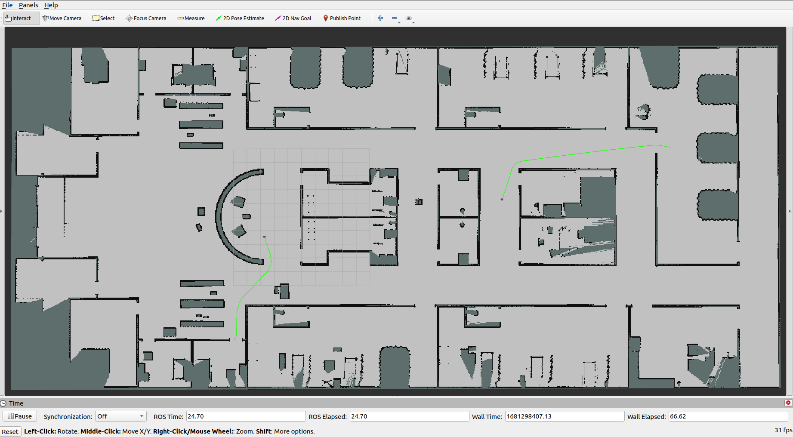
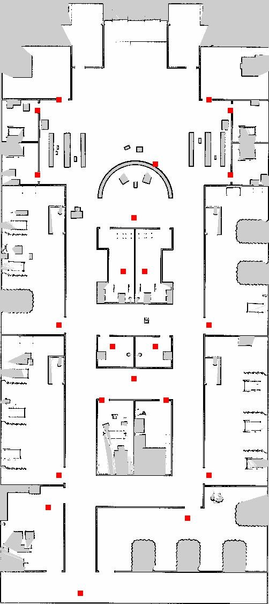
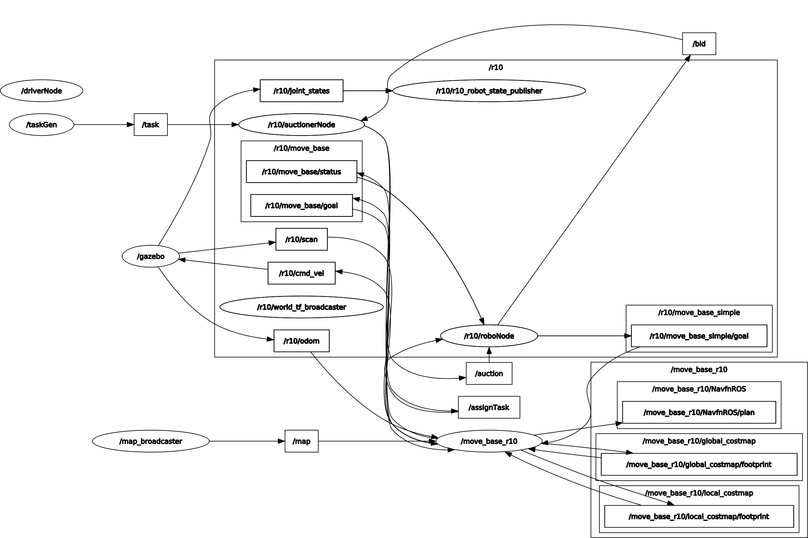
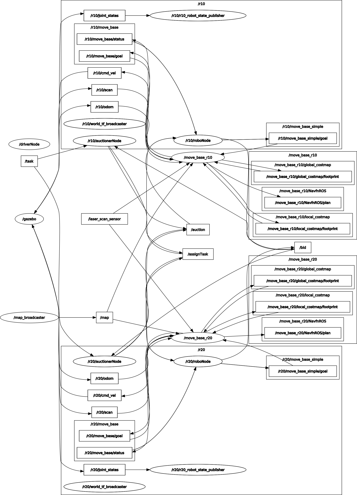

# multi_robot

This repo contains the a framework for multi-robot simulation on ubuntu using ROS noetic and gazebo.

## Table of Contents
  * [Installation](#installation)
  * [How to Use](#how-to-use) 
  * [Working](#working)
  


## Installation 
Pre-requisites: [ROS Noetic](http://wiki.ros.org/noetic), [Teb Local Planner](http://wiki.ros.org/teb_local_planner), [Turtlebot3](https://emanual.robotis.com/docs/en/platform/turtlebot3/overview/) and [Aws Hospital](https://github.com/aws-robotics/aws-robomaker-hospital-world).

After you are done with installing the pre-reqs, move to the src directory of your workspace and clone this repo and run catkin_make. Else, if you dont have a workspace, run 
```
mkdir catkin_ws/src
cd catkin_ws/src
git clone https://github.com/TD0013/multi_robot.git
cd ..
catkin_make
```
This sould successfully build the repo on your local device.

## How To Use
This is the basics of getting started with the code. Check [working](#working) for info on what is actually happening.
The main piece of code that runs everything is the [driver.py](./src/driver.py). Driver uses parameters set in the [SIMULATION.yaml](./param/SIMULATION.yaml) to initialize the environment. You can then start the [taskGenerator.py](./src/taskGenerator.py) to generate random tasks and check the performance of our algorithm in such environment.
So in seperate terminals, run:
```
roscore
```
```
rosrun multi_robot driver.py
```
```
rosrun multi_robot taskGenerator.py
```

This is the environment with 2 robots which are moving independently towards 2 goals.

## Working
### Environment Info
We use the [AWS Hospital Environment](https://github.com/aws-robotics/aws-robomaker-hospital-world) for simulation. 

We work on the assumption that even thoough the map is open, we can only have tasks to and from special areas. We define the coordinates of said areas in a [distance_params.yaml](./param/distance_params.yaml) file. If we visualize these on a map, we get 



The areas marked red on the map are the defined nodes. For more info on which node corresponds to which point, refer to [labels](/images/labels). 

The use of using these nodes is that it reduces the computation time in our algotithm. We seperately precompute the distances between each of these nodes using A* algorithm and store them as a distance matrix in a seperate file [dist.txt](/param/dist.txt)


### Environment Initialization
The driver code is responsible for starting the environment. It uses multiple launch files for the same. Hierarchically this happens as follows:

* Start the rosnode
* Read the simulation parameters from [SIMULATION.yaml](param/SIMULATION.yaml) and the distance parameters from [distance_params.yaml](param/distance_params.yaml). We will need the distance paramaeter file to convert the start nodes from the simulation parameters to coordinates, which are used for spawning the robots.We will need the simulation parameters to get the types and number of robots of each type that we have to spawn in the environment.
* Start an instance of roslaunch API, that will be used to call roslaunch from a python file. We will use this instance to launch each robot.
* Rviz is needed for visualization, but doesn't accept runtime arguments, so we write a [.rviz](/rviz/TD_rviz.rviz) file at per the simulation parameters.
* We launch the  [hospitalMinimal.launch](launch/hospitalMinimal.launch) file. This file launches gazebo, map_server and rviz. By default the gazebo visualization is set to false (change to true to view gazebo gui). This file also loads the simulation parameters to ros, so that all robots can use it.
* Next we launch all the robots as per the simulation.yaml file. We do this by specifying the robot name, and start coordiantes to the [roboLauncher.launch](launch/TD_roboLauncher.launch) file. This file and its working is described in more detail in [ROS Working](#ros-workings). The robots are named as "r"+robot_type(0,1,2 etc)+ robot_id(loops from 0 to robot type count per the simulation parameters). So, first robot of type 1 would be called "r10", second would be called "r11" and so on. Similarly, first robot of type 2 would be called "r20", second would be called "r21" and so on. The start positions are taken as nodes from the "start" given in simulation parameters, and converted to x, y coordinates per the distance parameters.


### ROS Workings


This rqt_graph shows the environment with one spawned robot in the environment. The bigger box describes a namespace in the ros environment. The smaller boxes are rostopics and the ovals are rosnodes.

With this graph as reference, the working of [roboLauncher.launch](launch/TD_roboLauncher.launch) can be explained better. The robolauncher node takes the robot's name and start coordinates as arguments and launches the robot. This includes spawning, starting robot's move_base pkg for control, robot's logic controller (roboNode), and robot's auctioner node (it may or may not be used after starting).

#### **Task Generation Node:**
The [taskGen Node](src/taskGenerator.py) generates specified number of tasks for robots in the environment. These tasks are stored in the buffers of auction capable robots in a round robin manner, for later auctioning [These tasks are not necessarily perfomed by the robot it is assigned to. It is only given for auctioning]

#### **Auctioner Node:**
The [auctionerNode](src/auctionerNode.py) takes takes the tasks from the taskGen node along the "/task" topic, and stores it in the auction buffer of the robot. Then, if an auction is not in progress and the task buffer is not empty, the task in front of the queue is auctioned. This actually means that the task is published on the "/auction" topic which is subscribed by all robots. All capable robots then submit their bids along the "/bid" topic. The auctioner node waits for AUCTION_TIME constant in the python file, which is 2 seconds by default and then evaluates all bids it recieved in that time. The task is either assigned to the best bidder, or if there is no relevenat bidder, the task is rejected [rejectionCount variable is increased and task is dropped]. For the winner of the bid, the auctionerNode publishes the task data, along with the bid winner's name on the "assignTask" topic.

#### **Robot Control Node:**
The [roboNode](src/roboNode_STN.py) performs multiple tasks.

* It computes bids on the new coming tasks, based on our algorithm. The computed bids are then published along with the robotName on the "/bid" topic.
* If the robot is the winner of the bid, it recieves the task from the "/assignTask" topic,  arranges it appropriately according to our algorithm and stores the task sequentially in a task buffer.
* If the robot is not currently performing any task, and the task buffer is not empty, it uses move_base to complete the next task in the task buffer. It does so by publishing the task data to the "/r10/move_base/goal" topic. The /(move_base_r10) node, which is subscribed to this, accepts this as the next goal and plans a path accordingly to travel, and publish data to "/r10/cmd_vel" topic to travel to this goal. [generically replace r10 with the (robot name) to get the nodes and topics for different robots]. Get more info on move_base pkg [here](http://wiki.ros.org/move_base)
* The node is also subscribed to the "/move_base_r10/status", and reads the data to see if the task is completed or not. This topic is used by (move_base_r10) node to publish the status of the current goal. Get more info on the goal status topic [here](http://docs.ros.org/en/kinetic/api/actionlib_msgs/html/msg/GoalStatus.html).

This similar architecture is extened to multiple robots like this: 



As you can see in this graph, 2 different robots have seperate robot control nodes, auctioner nodes and move_base nodes, which work with the common "/task", "/bid" and "/assignTask" topics.
